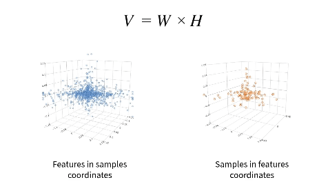

# DualSimplex algorithm's R package

## About the project
This is the implementation of the Dual Simplex method presented in [this paper](https://www.biorxiv.org/content/10.1101/2024.04.09.588652v1)

```angular2html
Non-negative matrix factorization and deconvolution as dual simplex problem
Denis Kleverov, Ekaterina Aladyeva, Alexey Serdyukov, Maxim Artyomov
bioRxiv 2024.04.09.588652; doi: https://doi.org/10.1101/2024.04.09.588652
```
This in essence is an NMF algorithm which can factorize nonegative matrix V into two nonnegative matrices W and H.

The key feature is that it operates in a lower dimensional space of a Sinkhorn-transformed original matrix,
which aligns both row and column data points of the original matrix via two interrelated geometrical simplex structures.

Therefore, in this space we can search only for K (K-1)-dimensional solution points (K is the number of components i.e. the number of columns/rows of W/H).



This method can be applied to:
- The general NMF problem, where it outperforms commonly used methods
- Bulk RNAseq deconvolution
- Single cell clustering

## Getting Started
### Prerequisites
This is an R language package so you need to have [R](https://www.r-project.org/about.html)

### Installation
Just for now it is:
```r
devtools::load_all()
```

After final tweaks, it will be: 
```r
devtools::install_github("artyomovlab/DualSimplex")
```

After the publication, it will be:
```r
install.packages("DualSimplex")
```


## Usage
### Read/Generate the data
```r
N <- 100 # number of samples (e.g. mixtures)
M <- 10000 # number of features (e.g. genes)
K <- 3 # Number of pure components

sim <- create_simulation(n_genes = M,
                         n_samples = N,
                         n_cell_types = K,
                         with_marker_genes = FALSE)
sim <- sim %>% add_noise(noise_deviation = 0.2)

data_raw <- sim$data
true_W <- sim$basis
true_H <- sim$proportions
```

### Create a Solver object
This performs Sinkhorn scaling, SVD projection, and data annotation
```r
dso <- DualSimplexSolver$new()
dso$set_data(data_raw) # run Sinkhorn procedure
dso$project(K) # project to SVD space
dso$plot_projected("zero_distance", "zero_distance", with_solution = TRUE, use_dims = list(2:3)) # visualize the projection
dso$set_display_dims(list(2:3)) # remember the use_dims choice, to call just dso$plot_projected()
```

### (Optional) Filter the data/remove outliers 
This is only if you are willing to remove points from your dataset
```r
plane_distance_threshold <- 0.05 # Change here several times to see result, start with big and lower it
zero_distance_threshold <- 1
dso$distance_filter(plane_d_lt = plane_distance_threshold, zero_d_lt = zero_distance_threshold, genes = T)
dso$project(K)
dso$plot_projection_diagnostics() # See the distribution of points distances
dso$plot_svd_history() # observe changes in SVD variance explained
```

### Identify simplex corners in the projected space
#### Initialize solution
```r
dso$init_solution("random")
dso$plot_projected("zero_distance", "zero_distance")
```

#### Run optimization
```r
dso$optim_solution(
    5000,
    optim_config(
        coef_hinge_H = 1,
        coef_hinge_W = 1,
        coef_der_X = 0.001, 
        coef_der_Omega = 0.001
    )
)
dso$plot_projected("zero_distance", "zero_distance")
dso$plot_error_history()
```

#### Get solution
```r
solution <- dso$finalize_solution()
result_W <- solution$W
result_H <- solution$H
```

### Save/Load the results
```r
# Save
dso$save_state("directory_to_save")

# Load
dso <- DualSimplexSolver$from_state("directory_to_save")
```

Check our additional [paper repository](https://github.com/artyomovlab/dualsimplex_paper) for more examples of NMF, bulk-RNAseq deconvolution and single cell clustering


## Contacts

-  Denis Kleverov ([@denis_kleverov](https://twitter.com/denis_kleverov)) ([linkedIn](https://linkedin.com/in/denklewer) )
-  Ekaterina Aladyeva ([@AladyevaE](https://twitter.com/AladyevaE)) 
-  Alexey Serdyukov ([email](mailto:leshaserdyukov@gmail.com))
-  prof. Maxim Artyomov ([@maxim_artyomov](https://twitter.com/maxim_artyomov)) ([email](mailto:martyomov@wustl.edu))


## Code structure & Guidelines

The following files in the `R/` directory represent different stages
of DualSimplex pipeline:
```
0. simulation.R
1. annotation.R
2. filtering.R
3. sinkhorn.R
4. projection.R
5. initialization.R
6. optimization.R
7. post_analysis.R
8. benchmarking.R
```

Ideally, main logic functions in a stage shouldn't use 
functions from another stage, and a downstream stage 
should only use the objects generated on the previous stage as its input. 

Then, either the user or `DualSimplexSolver` use the main
functions from those packages to implement the whole control flow.

This rule of thumb leads to linear code logic and low code coupling,
which makes it simple to debug and introduce changes.
